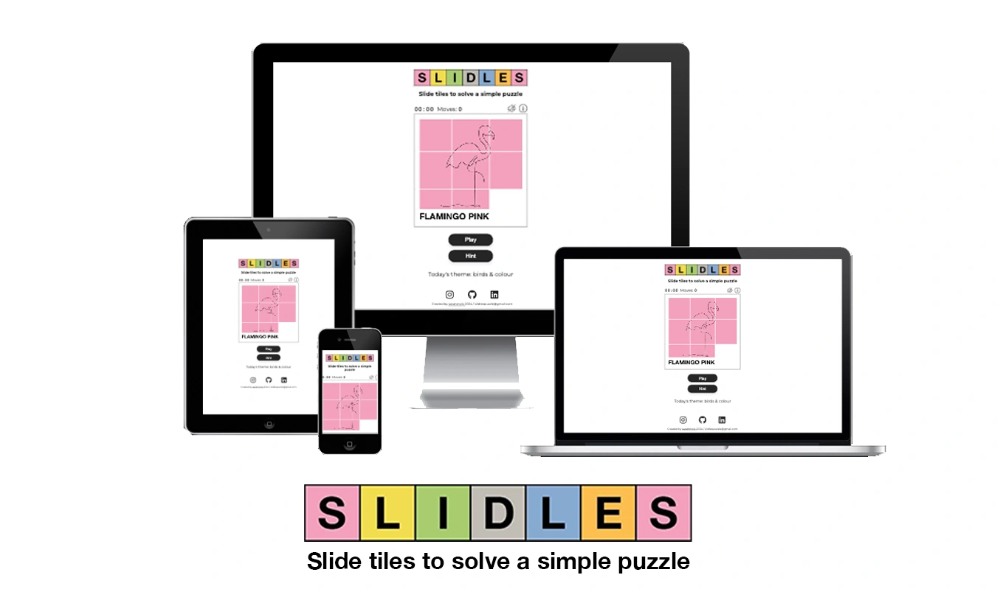

# Slidles

Welcome to Slidles, a vibrant puzzle game designed to keep your brain engaged with quick, satisfying challenges. Slidles combines the classic sliding tile puzzle with a fresh, minimalist design allowing for clean and easy navigation to solve our simple puzzles. Escape for a few minutes to enjoy the bright, eye-catching graphics and clean, intuitive interface. Slidles offers a refreshing experience for players of all ages. Each puzzle is engaging and rewarding, ensuring fun for both novice and seasoned puzzlers. Happy Sliding!

[Click here to play Slidles](https://slidles.com/)

## Acknowledgements 
- Thanks to my childhood tile-sliding puzzle for inspiration and Ozzy the dog on breaks. 
