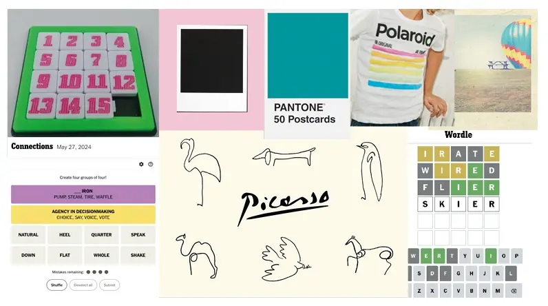

# Slidles

Welcome to Slidles, a vibrant puzzle game designed to keep your brain engaged with quick, satisfying challenges. Slidles combines the classic sliding tile puzzle with a fresh, minimalist design, allowing for cleann and easy navigation to solve our simple puzzles. Escape the complexity of modern digital life fro a few minutes with our bright, eye-catching graphics and clean, intuitive interface. Slidles offers a refreshing experience for players of all ages. Each puzzle is engaging and rewarding, ensuring fun for both novice and seasoned puzzlers. Happy Sliding!

[View Slidles Live Here](https://sarahmclo.github.io/slidles/)

## Table of Contents
1. [User Experience (UX)](#user-experience)
    - [Project Goals](#project-goals)
    - [User stories](#user-stories)
    - [Target Audience Goals](#target-audience-goals)
    - [Site Owner Goals](#site-owner-goals)
    - [First Time User Goals](#first-time-user-goals)
    - [Return User Goals](#return-user-goals)
2. [Design](#design)
    - [Design Philosophy](#design-philosophy)
    - [Design Choices](#design-choices)
    - [Colour Scheme](#colour-scheme)
    - [Typography](#typography)
    - [Imagery](#imagery)
    - [Wireframes](#wireframes)
    - [Structure](#structure)
    - [The 5 Elements](#the-5-elements)
3. [Features](#features)
    - [Logo](#logo)
    - [Favicon](#favicon)
    - [Timer](#timer)
    - [Moves](#moves)
    - [Audio](#audio)
    - [Puzzle](#puzzle)
    - [Footer](#footer)
4. [Technologies Utilised](#technologies-utilised)
    - [Languages](#languages)
    - [Frameworks and Programs](#frameworks-and-programs)
5. [Deployment](#deployment)
    - [Remote Deployment](#remote-deployment)
    - [Local Deployment](#local-deployment)
6. [Testing](#testing)
    - [Validation Testing](#validation-testing)
    - [Manual Testing](#manual-testing)
7. [Bugs and Fixes](#bugs-and-fixes)
8. [Finished Product](#finished-product)
9. [Future Features](#future-features)
10. [Credits](#credits)
    - [Content and Code](#content-and-code)
    - [Frameworks](#frameworks)
    - [Media](#media)
11. [Conclusion](#conclusion)
12. [Acknowledgements](#acknowledgements)

## User Experience (UX)
Our primary focus is on creating a seamless, enjoyable user experience. Slidles is designed with simplicity in mind, ensuring that users can navigate and play without any hassle. The vibrant design elements enhance engagement, making the puzzle-solving experience delightful and satisfying.

## User Experience (UX)
Our primary focus is on creating a seamless, enjoyable user experience. Slidles is designed with simplicity in mind, ensuring that users can navigate and play without any hassle. The vibrant design elements enhance engagement, making the puzzle-solving experience delightful and satisfying.

## Project Goals
The main goals of the Slidles project are to:
- Provide an accessible, engaging puzzle game for all ages.
- Combine classic gameplay with a modern, visually appealing interface.
- Ensure a smooth, intuitive user experience across all devices.

## User Stories
- As a user, I want to easily understand how to play the game without needing extensive instructions.
- As a user, I want the game to be challenging yet solvable, providing a sense of accomplishment.
- As a user, I want the design to be visually appealing and not overwhelming.

## Target Audience Goals
- Enjoy a quick, engaging mental challenge during short breaks.
- Experience a visually pleasing game that is easy to navigate.
- Feel a sense of achievement after solving puzzles.

## Site Owner Goals
- Attract and retain a broad audience with an engaging and well-designed puzzle game.
- Create a community of users who return to the game regularly.
- Ensure the site is easy to maintain and update with new features and puzzles.

## First Time User Goals
- Quickly understand how to play the game.
- Find the interface intuitive and the design appealing.
- Enjoy the initial experience and feel motivated to return.

## Return User Goals
- Experience new puzzles and challenges to keep the game engaging.
- Find improvements and updates that enhance the gameplay.
- Feel a sense of progression and increasing skill.

## Design 

### Design Philosophy
Our design philosophy centers on simplicity, vibrancy, and user engagement. We believe that a clean, aesthetically pleasing design enhances the user's focus on the puzzle itself.

### Design Choices
- **Minimalist Layout**: Ensures the focus remains on the puzzle.
- **Responsive Design**: Provides a seamless experience across all devices.
- **Interactive Elements**: Engages users through dynamic feedback.

- **Reference Images**

### Colour Scheme
A bright and vibrant color scheme is used to make the game visually stimulating. Colors are carefully chosen to create a balance between aesthetics and functionality.

- **Colour Palette**
The colour palette for this site was devised in keeping with the SLIDLES logo and created in [Adobe Color](https://color.adobe.com/).

- **Logo**
The SLIDLES logo is an original creation using Adobe Illustrator and a starting point for the clean appearance of the puzzle game area.

### Typography
We use clear, easy-to-read fonts that complement the vibrant design without distracting from the gameplay.

- **Fonts**
The fonts for this site were carefully chosen and imported from [Google Fonts](https://fonts.google.com/).

### Imagery
Minimal imagery is used, focusing on the tiles and the puzzle interface to keep the design clean and straightforward.

- **Hero Images**

- **Content Images**
 All images were optimised and converted to webp with [Convertio](https://convertio.co/).

### Wireframes

Wireframes serve as the blueprint for the website, outlining the layout and functionality of each page. They help us visualise the user experience and iterate on design concepts and scope before implementation.

Sketches

Wireframes for this site were created with [Figma](https://figma.com/).

- **Mobile Wireframes**

- **Desktop Page Wireframes**

### Structure

The structure of Slidles is designed for a seamless and intuitive user experience, with a clear content hierarchy, consistent navigation, and responsive design principles.

### Content Hierarchy
1. **Puzzle Area**: Central focus for gameplay.
2. **Timer and Moves Counter**: Visible to track progress.
3. **Navigation**: Easy access to new games, instructions, and settings.
4. **Footer**: Essential links and information.

### Navigation
- **Main Menu**: Links to start a game, instructions, and settings.
- **Footer Links**: Additional resources and contact info.

### Page Structure
- **Header**: Logo and main navigation.
- **Main Content**: Central puzzle area.
- **Sidebar (if applicable)**: Game options and settings.
- **Footer**: Secondary navigation and contact details.

### Grid System/Flexbox
- **Flexbox**: Ensures responsive, adaptive layout.
- **Dynamic Resizing**: Elements adjust based on screen size.

### Consistency
- **Design Elements**: Uniform colors, typography, and imagery.
- **Interaction**: Predictable behavior for interactive elements.
- **Layout**: Consistent across pages and devices.

### Whitespace
- **Enhances Readability**: Avoids clutter and improves focus.
- **Improves Navigation**: Clearly separates sections.

### Responsive Design
- **Mobile-Friendly**: Consistent experience on all devices.
- **Touch-Friendly**: Effective touch inputs.

### Accessibility
- **Keyboard Navigation**: Fully functional via keyboard.
- **Screen Reader Support**: Descriptive alt text and ARIA labels.
- **Color Contrast**: High contrast for visual impairments.

### User Flow
1. **Landing Page**: Brief introduction to the game.
2. **Game Start**: Immediate access to gameplay.
3. **Gameplay**: Smooth interaction with visible progress.
4. **Completion**: Clear feedback with options to start a new game or share.

By focusing on these structural elements, Slidles provides an engaging, enjoyable, and accessible experience for all users.

## ## Structure
### The 5 Elements
1. **Strategy**: Offering a classic puzzle game with a modern twist.
2. **Scope**: Focusing on a single, well-designed puzzle game.
3. **Structure**: Clear navigation and intuitive gameplay.
4. **Skeleton**: Wireframes ensure a user-friendly layout.
5. **Surface**: Bright, vibrant design elements create an engaging experience.

  
## Features 

### Logo
A simple, recognizable logo that reflects the game's playful and modern aesthetic.

- **Logo**

Our distinctive logo
Logo designed in Illustrator and converted to webp with [Convertio](https://convertio.co/).

### Favicon

Original creation designed in Adobe Illustrator this custom favicon stems from the designed logo which enhances recognition and improves user experience by providing a visual marker for the puzzle. 

### Timer:
Tracks the time taken to solve each puzzle, adding an element of challenge.

### Moves:
Counts the number of moves made, encouraging strategic thinking.

### Audio:
Subtle sound effects enhance the interactive experience without being distracting.

### Puzzle:
The core feature, designed to be engaging and rewarding, with varying levels of difficulty.

### Footer:
Contains essential social media links and contact information.

## Technologies Utilised 

### Languages

- [**HTML5**](https://developer.mozilla.org/en-US/docs/Web/HTML)
- [**CSS**](https://developer.mozilla.org/en-US/docs/Web/CSS)
- [**Javascript**](https://developer.mozilla.org/en-US/docs/Learn/JavaScript)

### Frameworks and Programs

- [**Gitpod**](https://www.gitpod.io/) Gitpod used for writing code, committing, and pushing to GitHub. 
- [**GitHub**](https://github.com/) GitHub utilised for hosting, viewing and some readme amendments.
- [**Google Fonts**](https://fonts.google.com/) Google Fonts used to import Inter and Roboto into stylesheet.
- [**Font Awesome**](https://fontawesome.com/) Font Awesome used throughout to add icons in order to create a better visual experience for the user.
- [**Figma**](https://figma.com/) Balsamiq utilised to create wireframes during the design phase.
- [**Responsive Design Checker**](https://responsivedesignchecker.com/) Responsive Design Checker used in the testing process to check responsiveness on various devices.
- [**Am I Responsive**](https://ui.dev/amiresponsive) Am I Responsive utilised to generate Mock Up Image of site in a responsive manner.
- [**Chrome DevTools**](https://developer.chrome.com/docs/devtools) Chrome DevTools utilised frequently during development process for code review and responsiveness tests.
- [**Browserstack**](https://www.browserstack.com/) Browserstack employed to test browser compatility across multiple devices.
- [**Shields.io**](https://shields.io/) Shields.io used to generate dynamic badges for Readme.
- [**Coolers Contrast Checker**](https://coolors.co/) Coolers Contrast Checker used to make sure colours contrasted well correctly for optimum accessibility.
- [**Adobe Colors**](https://color.adobe.com/) Adobe Colors helped to generate a pleasing colour palette in keeping with logo and overall design.
- [**Convertio**](https://convertio.co/) Convertio utilised to optimise images to webp for fast loading.

## Deployment 

Git was used for version control. Version control was done locally and remotely. For remote version control, GitHub was used. Regular commits were made after each file change.

### Remote Deployment

GitHub Pages was used to deploy the site remotely.

1. Login to [Git Hub](https://github.com/) Repository account
2. Navigate to my project repository colourway
3. Click the Settings near the top of the page
4. In the left-hand menu, find and click on the Pages
5. In the Source section, choose 'main' from the drop-down, select branch menu
6. Select 'root' from the drop-down folder menu
7. Click 'Save'
8. Project now live and a link is visible at the top of the page "Your site is published at https://github.com/sarahmclo/slidles/" 

### Local Deployment

To contribute or check the code, you can:
- Fork the repository
- Clone the repository

### How to Fork
1. To fork, go the repository
2. Click on the Fork button in the top left corner of the page
3. Fill in the form with either keep the name or create a new name for the repository

### How to Clone
1. To clone, go to repository
2. Click on the Code button above the repository files
3. A drop-down will appear and choose either
4. Go to your terminal and decide where you want to clone the files
5. Use the copy/paste button and copy it into your terminal
6. You also have the option to download a ZIP file of the code

## Testing 

### Validation Testing
### HTML

- **Index Page**

### CSS

- **Stylesheet**

### Javascript

### Accessibility

### Lighthouse Testing

### Semantic HTML

Semantic HTML tags were used to provide a clear and meaningful structure to the website content. This helps screen readers and other assistive technologies interpret and convey information accurately.

### ARIA (Accessible Rich Internet Applications)

ARIA attributes were utilised on links to enhance the accessibility of the site allowing for screen readers to accurately pick up information.

### Contrast and Readability

Coolers Contrast Checker was used to ensure sufficient contrast in colors chosen to make the content readable for users with visual impairments.

### Alt Text for Images

All images on the website include descriptive alternative text (alt text). This helps users with visual impairments understand the content and context of images even if they cannot see them.

### Responsive Design

The website is responsive, providing a seamless experience across various devices and screen sizes. This benefits users with different abilities and ensures a consistent and accessible user experience. Tested via Chrome DevTools and Responsive Design Checker as project progressed.

### Manual Testing

Manual testing for the site involves hands-on evaluation by human testers to ensure functionality, usability, and compatibility across various devices and browsers. By conducting the manual testing procedures below, we ensure the website functions smoothly, provides an optimal user experience, and meets desired standards.

- **Navigation Testing:** Manually testing the navigation menu ensured all links are working correctly and directing users to the intended pages.
The navigation menu is responsive and displays properly on different devices and screen sizes.
- **Subscribe Form Testing:** Testing the subscribe form ensured it functions correctly, allowing users to submit their information successfully. Validation messages were checked and ensured they appear when required fields are left blank or invalid data is entered.
- **Responsive Design Testing:** Testing the website on various devices (desktop, mobile, tablet) has ensured responsiveness and proper layout adaptation.
It is verified that all content remains accessible and readable across different screen sizes.
- **Content Hierarchy Testing:** Verified that the content hierarchy is maintained throughout the website, with clear headings, subheadings, and sections.
Content is logically organized and easy to navigate for users.
- **Cross-browser Compatibility Testing:** The website has been tested on different web browsers in Browserstack (Chrome, Firefox) to ensure compatibility and consistent performance. Layout and functionality issues specific to certain browsers have been addressed accordingly.
- **Form Submission Testing:** Subscribe form has been submitted with valid data and ensures successful submission and confirmation.
- **Page Structure Testing:** The ayout and structure of individual pages are consistent and aligned with the design specifications.
There are no formatting issues or discrepancies in the placement of content elements.
- **Accessibility Testing:** The website has been tested using accessibility tools to ensure compatibility and adherence to accessibility standards.
Proper labeling, alt text for images, and other accessibility features have been included.
- **Performance Testing:** The website's performance has been evaluated using tools like DevTools, WC3 Validator and Lighthouse to assess factors such as page load speed, performance metrics, and optimization opportunities.

## Bugs and Fixes 

Throughout the development process, we encountered and resolved various bugs to ensure a smooth and seamless user experience. Our rigorous testing procedures helped identify and address these issues promptly.

- ### Mark-up Validation Testing Bugs

- ### All Mark-up Validation Bugs resolved

|Bug / Errors | Where / Location site | Browser | Device | Fixed | Solution |
|-------------|-----------------------|---------|--------|:-----:|----------|
| Warning: The element: button; must not appear as a descendant of the a; element| Welcome & Subscribe Section (line 56) | Chrome | MacBook | Yes | Div container for button so as not inside a tag |
| Warning: Section lacks heading. Consider using h2 - h6 elements to add identifying headings to all sections | Welcome & subscribe section (line 59) | Chrome | MacBook | Yes | Use h2 for heading |
| Warning: Section lacks heading. Consider using h2 - h6 elements to add identifying headings to all sections | Photo-gallery section (line 81) | Chrome | MacBook | Yes | Use h2 for heading |
| Error: Frameborder attribute on iframe is obsolete | Map section (line 215) | Chrome | MacBook | Yes | Remove obsolete attribute and fixed in css |
| Error: Element h4 is not allowed as child element of ul | Contact section (line 284) | Chrome | MacBook | Yes | Remove heading from ul |
| Error: Stray script tag | Below body (Line 339) | Chrome | MacBook | Yes | Insert script code inside body |

- ### Lighthouse Testing Bugs ###

- ### One Lighthouse Bug Unresolved - Largest Contentful Paint affects Performance ###

|Bug / Errors | Where / Location site | Browser | Device | Fixed | Solution |
|-------------|-----------------------|---------|--------|:-----:|----------|
| Largest Contentful Paint element — 8,870 ms| Hero image & text section | Chrome | Apple MacBook | No | Reduce image size neumerous times but not fixed to full capacity |
| Reduce unused CSS — Potential savings of 20 KiB | CSS Stylesheet | Chrome | Apple MacBook | Yes | Refactored code in css stylesheet |
| Image elements do not have explicit width and height | Logo section | Chrome | Apple MacBook | Yes | Fix logo with specific dimensions |
| Minimize third-party usage | Colour Theory video section | Chrome | Apple MacBook | Yes | Used mp4 video rather than linking to external site|

- ### CSS Validation Testing Bugs ###

**Google Styles Error**

## Finished Product 

Our finished product is a testament to our dedication to providing a beautiful and functional design that showcases the transformative power of colour. From the intuitive user experience to the vibrant visual identity, every aspect of our website reflects our commitment to excellence.

Index Page Desktop

Index Page Mobile

Index Page iPad

Subscribed Page Desktop

Subscribed Page Mobile

## Future Features 

- New puzzle levels and challenges.
- Additional themes and color schemes.
- Social sharing features to engage with friends.

## Credits 

### Frameworks, Content and Code

* All text content written by myself for a fictional company and devised for educational purposes only.
* [Code-Institute](https://codeinstitute.net/ie/?nab=0) Walkthrough projects content.
* [MDN](https://developer.mozilla.org/en-US/) Web docs and tutorials.
* [StackOverflow](https://stackoverflow.com/) Troubleshooting code.
* [W3Schools](https://www.w3schools.com/) Javascript intro tutorials for navbar menu.
* [CSS Tricks - HTML Picture](https://css-tricks.com) Further CSS tutorials.
* [Web Dev - Browser level image lazy loading](https://web.dev/browser-level-image-lazy-loading/) Lazy load images after testing.
* [Flexbox](https://css-tricks.com/snippets/css/a-guide-to-flexbox/) Flexbox tutorials.
* [Codu](https://www.codu.co/) Inspiration.
* [Gitpod](https://www.gitpod.io/) Write, commit and push code to GitHub. 
* [GitHub](https://github.com/) Utilise for hosting, amending and viewing.
* [Figma](https://figma.com/) Create the detailed low-fidelity wireframes in the design phase.
* [Codepen](https://codepen.io/) Practice code.
* [JShint](https://jshint.com/) Javascript code validation and troubleshooting.
* [Responsive Design Checker](https://responsivedesignchecker.com/) Test responsiveness on various devices.
* [Am I Responsive](https://ui.dev/amiresponsive) Generate Mock Up Image of site in a responsive manner.
* [Chrome DevTools](https://developer.chrome.com/docs/devtools) Utilised regularly in development for code review and to test responsiveness.
* [Browserstack](https://www.browserstack.com/) Browserstack was utilised to test browser compatility across multiple devices.
* [Shields.io](https://shields.io/) Shields.io used to create dynamic badges for Readme.
* [Google Fonts](https://fonts.google.com/) Import carefully selected fonts.
* [Coolers Contrast Checker](https://coolors.co/) Ensure colour contrast inline with guidelines.
* [Adobe Colors](https://color.adobe.com/) Generate pleasing colour palette in keeping with logo and overall design.

### Media

* [Pexels](https://www.pexels.com/) Fictional team and company images.
* [FontAwesome](https://fontawesome.com/) Icons for navbar menu, contact section and social networks.
* [Favicon](https://favicon.io/) Created my own favicon with logo of page.
* [Convertio](https://convertio.co/document-converter/) Images converted to webp for optimal loading.
* [Colour Theory Basics by Sarah Renae Clark](https://www.youtube.com/watch?v=YeI6Wqn4I78) Video content on colour theory.
* [GoogleMaps](https://www.google.com/maps) Fictional location for company.

## Conclusion 

## Acknowledgements 
 
- Amy Richardson, my course facillitator.
- Rahul Lakahanpal, my mentor.
- CI Tutor Support and Student Care.
- Slack community for resources and daily motivation.
- Fellow course students for sharing.
- My own childhood tile-sliding puzzle.
- Ozzy the dog.